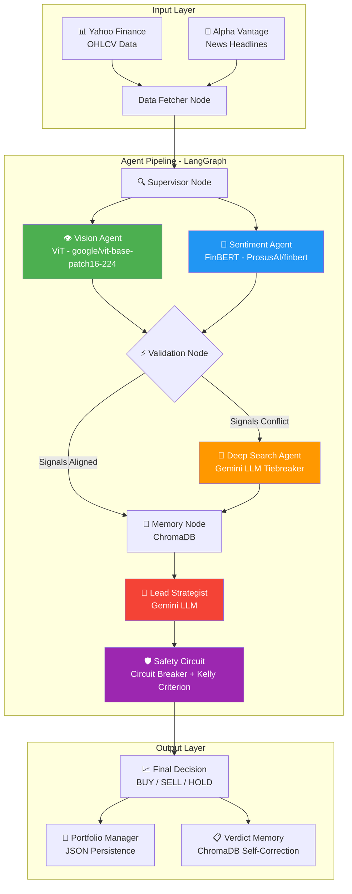

<p align="center">
  <h1 align="center">🤖 Automated ViT-Based Agentic Trading System</h1>
  <p align="center">
    <strong>A committee of goal-oriented AI agents that research, analyze, and trade stocks autonomously.</strong>
  </p>
  <p align="center">
    
    
    
    
    
    
  </p>
</p>

---

## 📌 Overview

This project implements a **multi-agent autonomous trading research system** that combines:

- **Vision Transformer (ViT)** for candlestick chart pattern recognition
- **FinBERT** for financial news sentiment analysis
- **Google Gemini LLM** as the lead strategist for final trade decisions
- **ChromaDB** for persistent memory and self-correction learning
- **LangGraph** to orchestrate the entire agent pipeline with conditional logic

The system features a **6-tab Streamlit dashboard** with a live portfolio manager, intelligent liquidation engine, automated backtesting, and real-time risk monitoring.

---

## 🏗️ System Architecture



### Agent Flow Summary

| Step | Agent | Model / Tool | Purpose |
|------|-------|-------------|---------|
| 1 | Data Fetcher | `yfinance` + `Alpha Vantage` | Pull OHLCV data and generate candlestick charts |
| 2 | Vision Agent | `google/vit-base-patch16-224` | Classify chart patterns as Bullish/Bearish |
| 3 | Sentiment Agent | `ProsusAI/finbert` | Analyze 50+ news headlines for market sentiment |
| 4 | Validation | Rule-Based | Detect signal contradictions between ViT and FinBERT |
| 5 | Deep Search | `Gemini LLM` | Resolve conflicts by scraping more data and reasoning |
| 6 | Memory | `ChromaDB` | Query past similar patterns for self-correction |
| 7 | Strategist | `Gemini LLM` | Final BUY/SELL/HOLD decision with confidence score |
| 8 | Safety Circuit | `Kelly Criterion` + `Circuit Breaker` | Enforce risk limits (2% max drawdown) |

---

## ✨ Dashboard Features (6 Tabs)

### 🏦 Tab 1: Portfolio Dashboard
> The main command center for your investments.

- **Huge Metric Display**: Total Invested, Current Value, Unrealized P&L ($ and %)
- **Active Holdings Ledger**: Ticker, Shares, Avg Entry Price, Live Price, Days Held, Individual P&L
- **Smart Buy Order**: Enter an amount + ticker → Agent runs full ViT+FinBERT analysis → Formally executes the buy if signals are positive
- **Intelligent Liquidation**: Enter a target cash amount (e.g., "$5,000") → Agent computes the optimal mix of stocks to sell, prioritizing bearish/underperforming positions

### 🔬 Tab 2: Live Analysis
- Run the full multi-modal analysis pipeline on any ticker
- Displays the generated candlestick chart with Bollinger Bands
- Shows the complete agent reasoning chain step-by-step

### 🖥️ Tab 3: Agent Terminal
- Real-time streaming console showing the agent's internal "thought process"
- Simulates the hourly automation cycle across a watchlist of tickers
- Perfect for live demonstrations

### 📈 Tab 4: Automated Backtest
- Configure ticker, lookback period, and starting capital
- Runs the agent over historical data and tracks equity curve
- Generates a downloadable **professional PDF report** with performance metrics (Sharpe ratio, win rate, max drawdown)

### 🧠 Tab 5: Memory & Learning
- Browse the agent's ChromaDB verdict history
- View self-correction accuracy stats ("Out of 10 similar patterns, I was right 6 times")
- Manually record trade outcomes to improve future predictions

### 🛡️ Tab 6: Risk Monitor
- Real-time Circuit Breaker status (🟢 Active / 🔴 HALTED)
- Kelly Criterion position sizing parameters
- Automated post-mortem reports when the circuit breaker triggers

---

## 📁 Project Structure

```
Automated-vit-based-trading-agent/
├── main.py                          # CLI entry point
├── requirements.txt                 # Python dependencies
├── .env.example                     # API key template
├── dashboard/
│   └── app.py                       # 6-tab Streamlit dashboard
├── src/
│   ├── agent/
│   │   ├── graph.py                 # LangGraph workflow with conditional edges
│   │   ├── nodes.py                 # 8 agent node implementations
│   │   ├── state.py                 # AgentState schema (TypedDict)
│   │   └── deep_search.py           # Contradiction resolution agent
│   ├── data/
│   │   └── ingestion.py             # Yahoo Finance + Alpha Vantage data fetching
│   ├── tools/
│   │   ├── vision.py                # ViT chart pattern classifier
│   │   └── sentiment.py             # FinBERT news sentiment analyzer
│   ├── memory/
│   │   └── vector_store.py          # ChromaDB verdict + self-correction memory
│   ├── trading/
│   │   ├── risk.py                  # Circuit Breaker + Kelly Criterion
│   │   └── portfolio.py             # Portfolio Manager + Liquidation Engine
│   └── evaluation/
│       └── backtest.py              # Backtest engine + PDF report generator
├── finbert-branch-output.ipynb      # FinBERT reference notebook
├── notebook4624369ca8.ipynb         # ViT reference notebook
└── kaggle_training_script.py        # ViT training script for Kaggle
```

---

## 🚀 Getting Started

### Prerequisites

- **Python 3.10+**
- **Google Gemini API Key** (free at [ai.google.dev](https://ai.google.dev))
- **Alpha Vantage API Key** (free at [alphavantage.co](https://www.alphavantage.co/support/#api-key))

### 1. Clone the Repository

```bash
git clone https://github.com/Venksaiabhishek/Automated-vit-based-trading-agent.git
cd Automated-vit-based-trading-agent
```

### 2. Create Virtual Environment

```bash
python -m venv venv
source venv/bin/activate        # macOS/Linux
# venv\Scripts\activate         # Windows
```

### 3. Install Dependencies

```bash
pip install -r requirements.txt
```

### 4. Configure API Keys

```bash
cp .env.example .env
```

Edit `.env` and add your keys:
```env
GEMINI_API_KEY=your_gemini_api_key_here
ALPHAVANTAGE_API_KEY=your_alphavantage_key_here
```

### 5. Run the System

**Option A — CLI Mode** (single analysis):
```bash
python main.py
```

**Option B — Dashboard** (full interactive UI):
```bash
streamlit run dashboard/app.py
```

> **Note:** The first run will download ~800MB of AI models (ViT, FinBERT, ChromaDB embeddings). Subsequent runs use the cached models and are fast.

---

## 🛠️ Tech Stack

| Component | Technology |
|-----------|-----------|
| Agent Orchestration | LangGraph |
| Vision Analysis | HuggingFace ViT (`google/vit-base-patch16-224`) |
| Sentiment Analysis | HuggingFace FinBERT (`ProsusAI/finbert`) |
| Strategy LLM | Google Gemini (2.0-flash / 2.5-flash / 1.5-flash fallback) |
| Vector Memory | ChromaDB |
| Market Data | Yahoo Finance (`yfinance`) |
| News Data | Alpha Vantage News Sentiment API |
| Dashboard | Streamlit |
| PDF Reports | FPDF2 + Matplotlib |
| Risk Management | Kelly Criterion + Custom Circuit Breaker |

---

## ⚠️ Disclaimer

This project is for **educational and research purposes only**. It does not constitute financial advice. The system uses simulated/paper trading — no real money is at risk. Always consult a qualified financial advisor before making investment decisions.

---

## 📄 License

This project is open source and available under the [MIT License](LICENSE).
